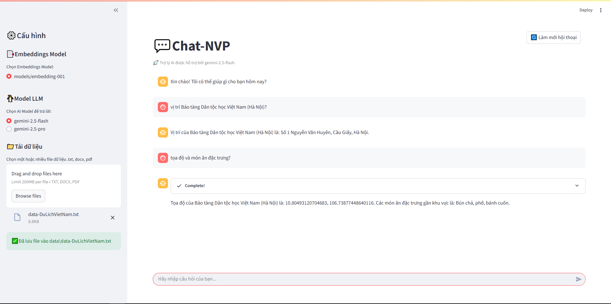

# FREE Chatbot RAG với LangChain và Google Gemini 

Dự án này xây dựng một chatbot thông minh sử dụng kiến trúc Retrieval-Augmented Generation (RAG), được triển khai bằng Streamlit, LangChain và sức mạnh từ các mô hình ngôn ngữ lớn (LLM) của Google Gemini. Chatbot có khả năng trả lời các câu hỏi dựa trên một kho tài liệu được cung cấp, giúp cung cấp thông tin chính xác và phù hợp với ngữ cảnh.

## Demo


## 🚀 Tính năng nổi bật

- **Giao diện Web thân thiện**: Xây dựng bằng Streamlit, cho phép người dùng tương tác dễ dàng.
- **Hỗ trợ đa dạng định dạng tài liệu**: Có thể tải lên và xử lý các tệp `.txt`, `.docx`, và `.pdf`.
- **Cơ chế Retrieval tiên tiến**: Kết hợp giữa tìm kiếm dựa trên vector (FAISS) và tìm kiếm dựa trên từ khóa (BM25) để tăng độ chính xác của thông tin được truy xuất.
- **Tích hợp Google Gemini**: Sử dụng các mô hình mạnh mẽ như `gemini-2.5-flash` và `gemini-2.5-pro` để tạo ra câu trả lời chất lượng cao.
- **Lưu trữ và quản lý lịch sử hội thoại**: Giúp chatbot duy trì ngữ cảnh trong suốt cuộc trò chuyện.
- **Cấu hình linh hoạt**: Cho phép người dùng tùy chọn mô hình embedding và mô hình LLM ngay trên giao diện.


## 🧱 Cấu trúc thư mục

```
├── main.py                # Giao diện và điều khiển chính bằng Streamlit
├── llm_gemini.py          # Hàm gọi LLM và thiết lập retriever
├── seed_data.py           # Xử lý và vector hóa tài liệu
├── data/                  # Thư mục chứa file tài liệu người dùng upload
└── .env                   # Chứa GOOGLE_API_KEY (không public)
```


## 🏛️ Kiến trúc

Dự án tuân theo kiến trúc RAG, bao gồm hai giai đoạn chính:

1.  **Truy xuất (Retrieval)**:
    -   Khi người dùng tải lên tài liệu, nội dung sẽ được chia thành các đoạn nhỏ (chunks).
    -   Các chunks này được chuyển đổi thành vector embedding bằng mô hình `models/embedding-001` của Google và được lưu trữ trong một cơ sở dữ liệu vector (FAISS).
    -   Khi người dùng đặt câu hỏi, hệ thống sử dụng một `EnsembleRetriever` (kết hợp FAISS và BM25) để tìm kiếm và truy xuất các chunks tài liệu có liên quan nhất đến câu hỏi.

2.  **Tạo sinh (Generation)**:
    -   Các chunks tài liệu đã được truy xuất sẽ được đưa vào một prompt template cùng với câu hỏi của người dùng.
    -   Prompt hoàn chỉnh này được gửi đến mô hình Gemini (ví dụ: `gemini-1.5-flash`).
    -   Mô hình Gemini sẽ tạo ra một câu trả lời tự nhiên và chính xác dựa trên thông tin được cung cấp trong prompt.

## ⚙️ Cài đặt và Chạy dự án

### 1. Các bước cài đặt

__a. Cài đặt các thư viện cần thiết:__

```bash
pip install -r requirements.txt
```

__b. Cấu hình API Key:__

Tạo một tệp tin có tên là `.env` và thêm vào đó `GOOGLE_API_KEY` của bạn:

```javascript
GOOGLE_API_KEY="YOUR_GOOGLE_API_KEY"
```

### 2. Chạy ứng dụng

Sau khi hoàn tất các bước cài đặt, chạy ứng dụng Streamlit bằng lệnh sau:

```bash
streamlit run main.py
```


## Liên hệ

Có câu hỏi thắc mắc xin vui lòng liên hệ qua email: nguyenphuongv07@gmail.com.
